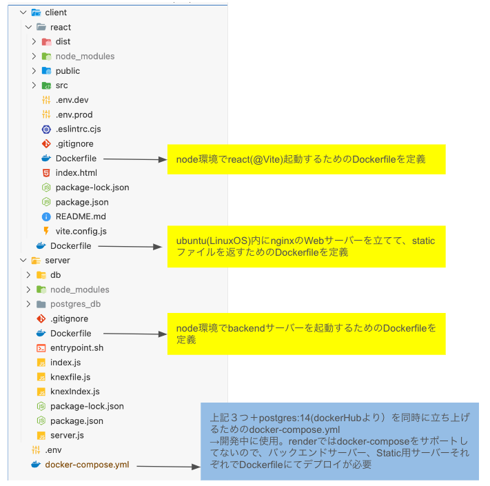
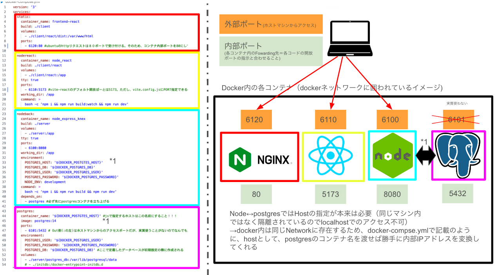

# フォルダ構成の概要



# システム設計の概要（開発環境時）



# 使用方法

## 1. 開発環境

- ルートディレクトリにて、下記コマンドで各コンテナを起動。外部ポート側でブラウザからアクセス可能になる
  ```zh
  docker compose up
  ```
  - 上記は -d オプションをつけていないので、Foreground にて実行されるのでログを確認できる
  - 各コンテナに入る場合は下記コマンドを実行
  ```zh
  docker exec -it コンテナ名 /bin/bash
  ```
  - postgres の DB に入る際は下記を実行。先に上記でコンテナ内に入る必要あり。postgers はルートディレクトリの.env で設定しているユーザー名が入る
  ```zh
  psql -U postgres -d データベース名
  ```

## 2. 本番環境

- render では docker-compose がサポートされていないので上記は使えず、それぞれでデプロイ
- 1. postgresDB 2. Node バックエンドサーバー 3.nginx@ubuntu の静的ファイルを返却する Web サーバー
- 2.の環境変数に「DATABASE_URL , NODE_ENV」を設定すること

## 特に詰まったところ

### 1. Node サーバー用のコンテナ

- npm install するためには、package.json が必要なため、その前のコードでに COPY しておく必要がある
- migration、seed をデプロイ時（CMD が実行されるタイミング）で実施したいので、CMD に２つのコマンドを記載。本来は CMD では実行の npm run start のみが理想

### 2. Node サーバー用コンテナ ↔︎Postgres サーバー用コンテナの連携（開発環境の話）

- それぞれ別のコンテナで起動しているため host で localhost の指定はできない
- postgres サーバー用のコンテナ名を指定すると同ネットワーク内で起動されており、Docker 側が内部 IP アドレスの解決を自動でしてくれる
- そのため、postgres サーバー用のコンテナ名を環境変数 POSTGRES_HOST として Node サーバー用コンテナに渡している

### 3. react 用サーバーコンテナをブラウザから見れない

- 通常 npm run dev でホストマシンの 5173 ポートに React 用サーバーが開放される場、コンテナ起動の場合はこのままではアクセスできない
- dev スクリプトの最後に「--host」オプションをつけることで、コンテナの IP アドレスが自動で解決される

### 4. 環境変数について

- docker-compose.yml にて定義されている環境変数は各コンテナから参照可能。process.env で見れる
- Pass で環境変数が設定された場合は名前が被っていても Paas 側が優先される
- react の build 時にできるファイルはすでに環境変数が組み込まれてしまている。そのため static 用サーバーに環境変数を再定義しても JS から見ることができない！！！
